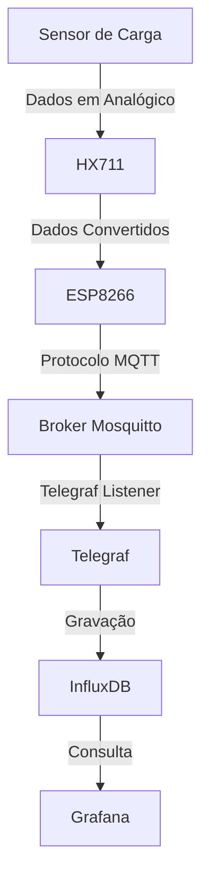

# **Trabalho de Graduação (TG): Integração de Sensores de Carga e Tecnologia IoT**

Este repositório contém o código-fonte e documentação relacionados ao trabalho de graduação que explora a integração de sensores de carga com tecnologia IoT para automação e monitoramento de materiais em linhas de produção.

---

## **Índice**
- [Introdução](#introdução)
- [Objetivos](#objetivos)
- [Componentes Utilizados](#componentes-utilizados)
- [Arquitetura do Sistema](#arquitetura-do-sistema)
- [Tecnologias Utilizadas](#tecnologias-utilizadas)
- [Configuração do Ambiente](#configuração-do-ambiente)
- [Como Executar](#como-executar)
- [Resultados e Benefícios](#resultados-e-benefícios)
- [Documentação Completa](#documentação-completa)

---

## **Introdução**
O trabalho propõe a construção de um sistema para monitoramento automatizado de materiais em uma linha de produção, substituindo processos manuais por uma solução baseada em sensores de carga e tecnologia IoT. Os dados coletados são armazenados em um banco de dados e exibidos em tempo real através de um dashboard, promovendo maior eficiência no controle logístico.

---

## **Objetivos**
1. **Automação**: Eliminar a necessidade de monitoramento manual de peças.
2. **Escalabilidade**: Implementar uma solução flexível e adaptável a diferentes linhas de produção.
3. **Visualização em Tempo Real**: Apresentar dados coletados de forma clara e acessível.
4. **Otimização Logística**: Melhorar o processo de reposição e controle de materiais.

---

## **Componentes Utilizados**

### **Hardware**
- **2x Células de Carga**: Meia Ponte Wheatstone.
- **1x Módulo Semiconductor HX711**: Amplificador para as células de carga.
- **1x ESP8266 NodeMCU V3 (12-E)**: Microcontrolador responsável pela coleta e envio dos dados.

### **Software**
- **Telegraf**: Coletor de métricas configurável.
- **InfluxDB**: Banco de dados para armazenar as medições de peso e quantidade.
- **Grafana**: Ferramenta de visualização de dados.
- **Mosquitto**: Broker MQTT para comunicação entre dispositivos.

---

## **Arquitetura do Sistema**



---

## **Tecnologias Utilizadas**

- **Linguagens**: 
  - Python (Backend e scripts MQTT).
- **Protocolos**:
  - MQTT (Message Queue Telemetry Transport).
- **Infraestrutura**:
  - Banco de Dados Time Series (InfluxDB).
  - Coletor e processador de métricas (Telegraf).
  - Visualização e monitoramento (Grafana).

---

## **Configuração do Ambiente**

1. **Instalar os softwares necessários**:
   ```bash
   sudo apt update
   sudo apt install -y mosquitto influxdb grafana telegraf
   ```
2. **Configurar o InfluxDB**:
   - Criar banco de dados:
     ```bash
     influx
     CREATE DATABASE example;
     ```

3. **Configurar o Telegraf**:
   - Editar o arquivo de configuração `/etc/telegraf/telegraf.conf` para integrar com o broker MQTT e o InfluxDB.

4. **Instalar as dependências do Python**:
   - Criar ambiente virtual:
     ```bash
     python -m venv venv
     source venv/bin/activate
     ```
   - Instalar pacotes:
     ```bash
     pip install -r requirements.txt
     ```

---

## **Como Executar**

1. **Iniciar os serviços**:
   ```bash
   sudo service mosquitto start
   sudo service influxdb start
   sudo service grafana-server start
   sudo telegraf
   ```

2. **Executar o publicador MQTT**:
   ```bash
   python mqtt_publisher.py
   ```

3. **Executar o assinante MQTT**:
   ```bash
   python mqtt_subscriber.py
   ```

4. **Acessar o dashboard**:
   - Acesse o Grafana em `http://localhost:3000`.
   - Use as credenciais padrão (`admin/admin`) e configure o painel.

---

## **Resultados e Benefícios**

- **Visualização em tempo real**: Dados de peso e quantidade são exibidos em um dashboard personalizável.
- **Eficiência logística**: O sistema otimiza o reabastecimento de materiais, reduzindo atrasos e erros.
- **Escalabilidade**: A solução pode ser aplicada a outras indústrias com requisitos semelhantes.

---

## **Documentação Completa**
Para mais detalhes, acesse o documento completo do projeto:  
[INTEGRAÇÃO DE SENSORES DE CARGA E TECNOLOGIA IOT EM ARMAZÉNS INDUSTRIAIS](https://www.fateccruzeiro.edu.br/projetos/acervo/82aa4b0af34c2313a562076992e50aa3.pdf)

---

## **Contato**
Em caso de dúvidas ou sugestões, entre em contato:
- **Autores**: Leonardo Paixão e Rafael Ferreira
- **Email**: leonardohspaixao@gmail.com e rafaelferreira.1951@gmail.com